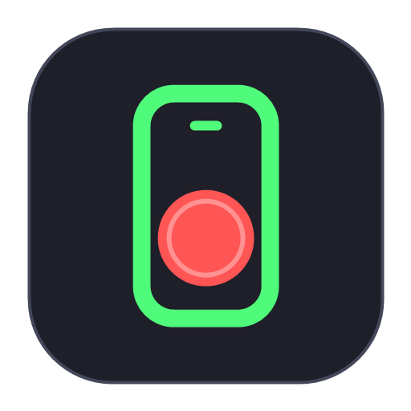
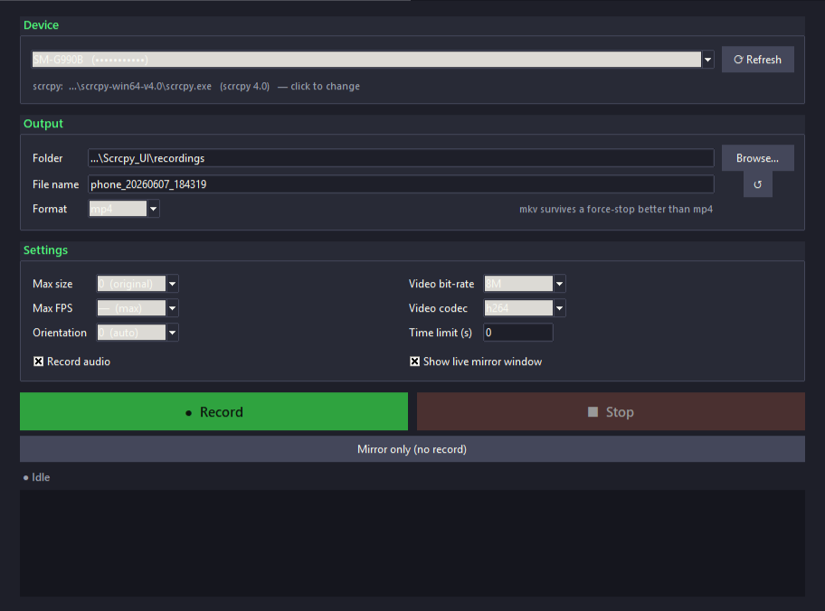

  

# How to use Scrcpy_UI

A friendly, step-by-step guide. If you just want the short version: plug in your
phone, run the app, click **Record**.

  

---

## 1. One-time setup

### a) Install Python
Download Python 3.8+ from [python.org](https://www.python.org/downloads/).
During install, tick **“Add Python to PATH.”** (Tkinter, used for the window, is
included automatically.)

### b) Get scrcpy
Download a Windows build from the
[scrcpy releases page](https://github.com/Genymobile/scrcpy/releases) and unzip
it. Then do **one** of these:

- Put the unzipped `scrcpy-win64-*` folder **next to** `scrcpy_ui.py`, **or**
- Install it system-wide so it's on your PATH:
  `winget install Genymobile.scrcpy` (or `scoop install scrcpy`), **or**
- Just run the app — if it can't find scrcpy, it'll ask you to point at
  `scrcpy.exe` once and remember it.

### c) Prepare your phone
1. Open **Settings → About phone** and tap **Build number** 7 times to unlock
   **Developer options**.
2. In **Settings → Developer options**, turn on **USB debugging**.
3. Connect the phone to your PC with a USB cable.
4. A prompt **“Allow USB debugging?”** appears on the phone — tap **Allow**
   (tick “Always allow from this computer” to skip it next time).

---

## 2. Daily use

1. **Launch the app** — double-click **`Scrcpy_UI.bat`**.
   > This opens the **control panel** (buttons + settings). It does **not** show
   > your phone screen yet — that's the next step.
2. Click **⟳ Refresh** — your phone should appear in the **Device** dropdown
   (e.g. `SM-G990B (RF...)`).
3. **To record:** click **● Record**. Your phone screen opens in a window **and**
   recording starts.
4. **To stop:** click **■ Stop**. The video is saved (and finalized cleanly) to
   the output folder.
5. **Just want to see the screen, no recording?** Click **Mirror only (no record)**.

That's it. 🎬

---

## 3. Settings cheat-sheet

| Setting | What it does |
|---|---|
| **Folder / File name / Format** | Where the recording is saved, and `.mp4` vs `.mkv` |
| **Max size** | Caps the longest side (e.g. 1920). *Original* = full resolution |
| **Video bit-rate** | Higher = better quality + bigger file (8M is a good default) |
| **Max FPS** | Limit frame rate (e.g. 30) to save size; *max* = uncapped |
| **Video codec** | h264 (most compatible), h265 (smaller), av1 (smallest, slowest) |
| **Orientation** | Rotate the recording 0/90/180/270° |
| **Time limit (s)** | Auto-stop after N seconds (0 = no limit) |
| **Record audio** | Capture phone audio too (needs Android 11+) |
| **Show live mirror window** | Off = record **headless** (no window). Leave **on** to watch while recording |

---

## 4. FAQ / Troubleshooting

**I launched the app but my phone screen didn't appear.**
That's normal — launching only opens the control panel. **Click ● Record** (or
**Mirror only**) to open the phone screen.

**The device dropdown says “No device.”**
- Make sure USB debugging is on and you tapped **Allow** on the phone.
- Click **⟳ Refresh**.
- Try a different USB cable/port (some cables are charge-only).
- If it shows **⚠ unauthorized**, re-plug and accept the prompt on the phone.

**It says scrcpy wasn't found.**
Click the **“scrcpy: … — click to change”** line (under the device box) and
browse to `scrcpy.exe`. See setup step 1b.

**Clicking Record records but shows no window.**
Tick **“Show live mirror window”** in Settings — when it's off, scrcpy records
without a preview window on purpose.

**My .mp4 looks broken after a crash/forced stop.**
mp4 needs a clean finish. Use the **Stop** button (it finalizes the file). If you
expect abrupt stops (e.g. unplugging), record to **mkv** instead — it tolerates
interruptions much better.

**Audio isn't recorded.**
scrcpy audio needs **Android 11 or newer**, and **Record audio** must be ticked.

---

## 5. Handy keyboard shortcuts (inside the mirror window)

scrcpy itself provides these while the phone window is focused:

| Shortcut | Action |
|---|---|
| `Left-Alt`/`Left-Super` + `f` | Toggle fullscreen |
| `MOD` + `r` | Rotate screen |
| `MOD` + `o` | Turn device screen off (keeps mirroring) |
| `MOD` + `n` | Expand notification panel |
| `Right-click` | Back |
| `Middle-click` | Home |

(`MOD` defaults to Left-Alt or Left-Super.) Full list:
<https://github.com/Genymobile/scrcpy/blob/master/doc/shortcuts.md>
